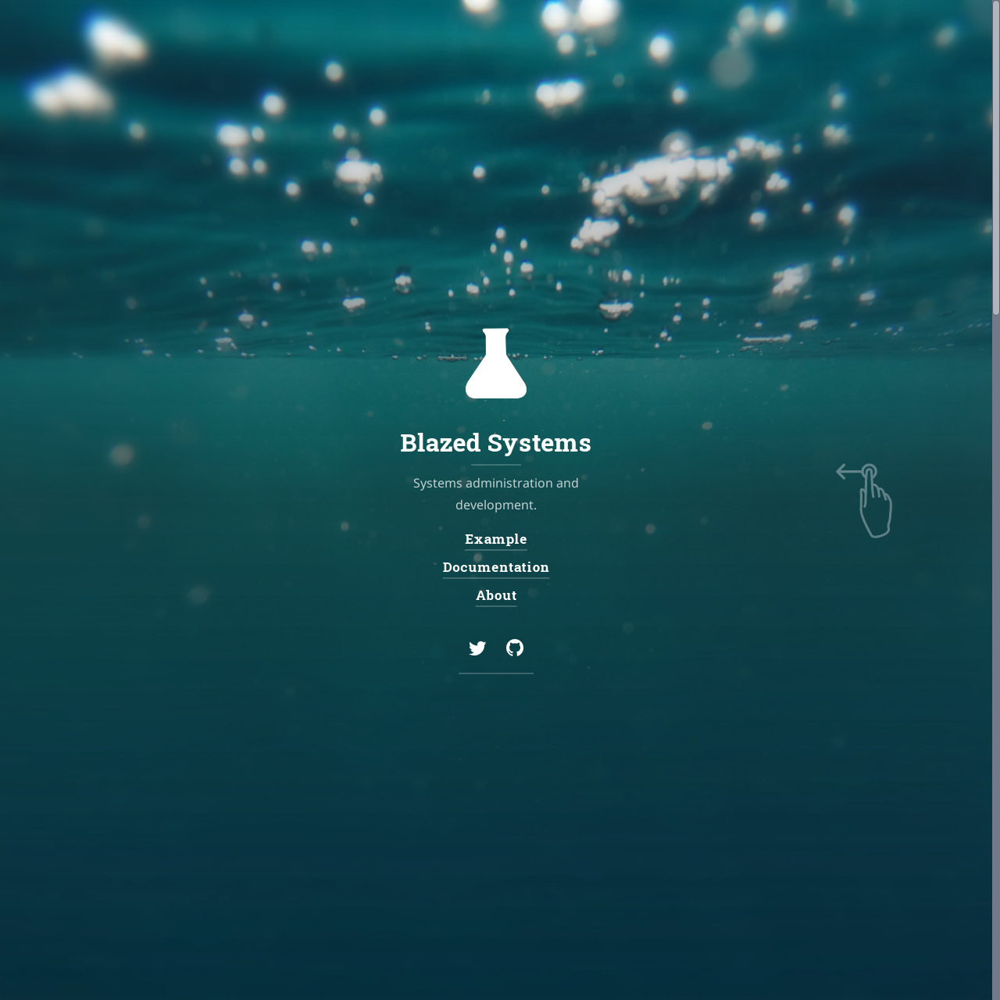

# Blazed Systems

A quicker, cleaner way to get started blogging with [Hydejack](https://hydejack.com/).

## Quick Start
### Running locally
1. Clone repository (git users), or [download] and unzip.
2. Open terminal, `cd` into root directory (where `_config.yml` is located)
3. Run `bundle install` [^1]
4. Run `bundle exec jekyll serve`
5. Open <http://localhost:4000/hydejack-starter-kit/>

